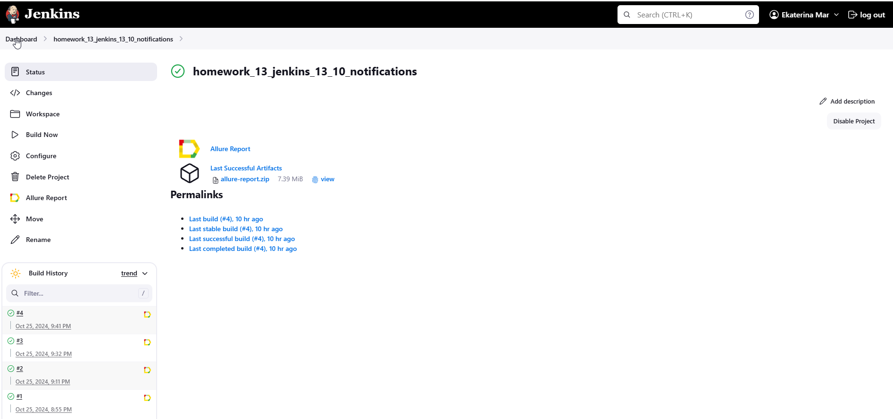
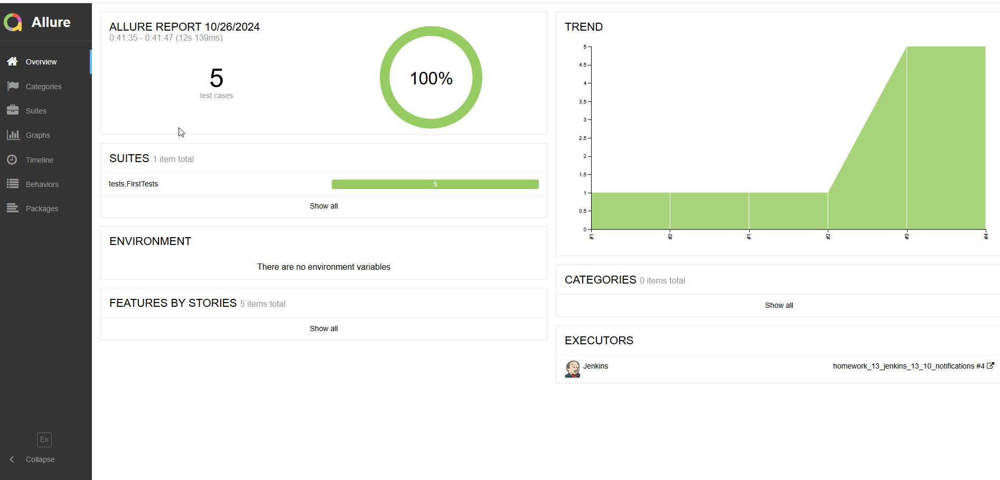
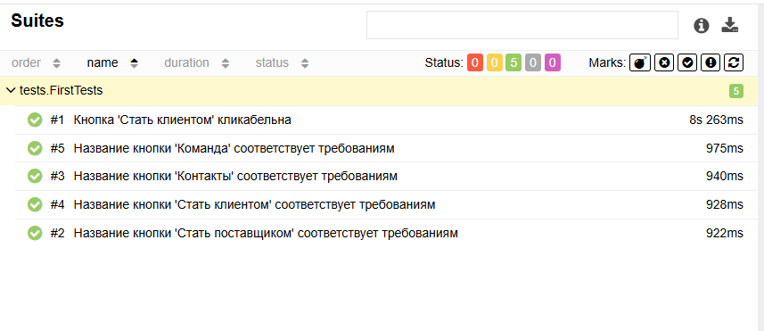
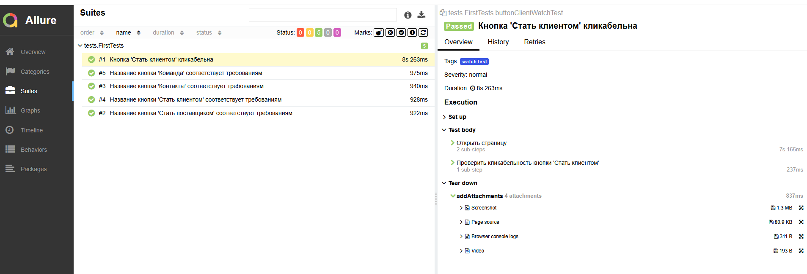
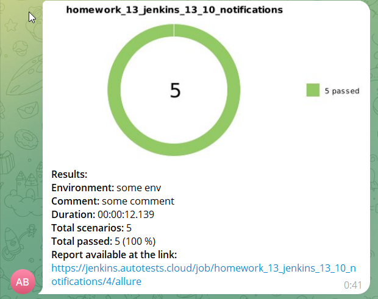

# Тесты для сайта uptrade.ru 

## Содержание

* <a href="#tests">Что проверяют тесты?</a>
* <a href="#jenkins">Jenkins</a>
* <a href="#allure">Отчет в Allure</a>
* <a href="#telegramBot">Уведомления в Telegram bot</a>
* <a href="#video">Видео прохождения тестов</a>

---

## <a name="Что проверяют тесты?">**Что проверяют тесты?**</a>

5 тестов на проверки верхнеуровнего функционала [сайта](https://uptrade.ru/), вакансия публиковалась в [Telegram](https://t.me/qa_jobs/227137). Тесты проверяют кликабельность кнопки и соответствие названий основных кнопок требованиям.

---

## <a name="Jenkins:">**Jenkins:**</a>

Тесты запускаются через [Jenkins](https://jenkins.autotests.cloud/job/homework_13_jenkins_13_10_notifications/)  

Для запуска тестов необходимо нажать на кнопку "Build Now". Появится прогресс бар с номером сборки тестов. 

---

## <a name="Отчет в Allure">**Отчет в Allure**</a>

После окончания прогона тестов формируется отчет [Allure](https://jenkins.autotests.cloud/job/homework_13_jenkins_13_10_notifications/4/allure/)
### На скриншоте результаты отчета пяти тестов:

Есть возможность просмотреть более детальный отчет, нажав на тестовый набор и откроются названия всех тестов

При нажатии на определенный тест, раскрываются шаги теста с приложенными вложениями

---

## <a name="Уведомления в Telegram bot">**Уведомления в Telegram bot**</a>

Для быстрой визуализации отчетности, после выполнения тестов, результат отчета дублируется в Telegram бот:

    

---

## <a name="Видео прохождения тестов">**Видео прохождения тестов**</a>

   

